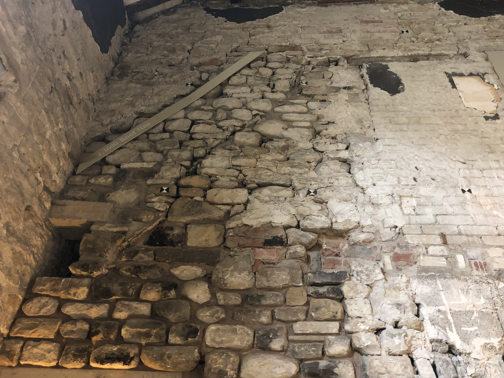
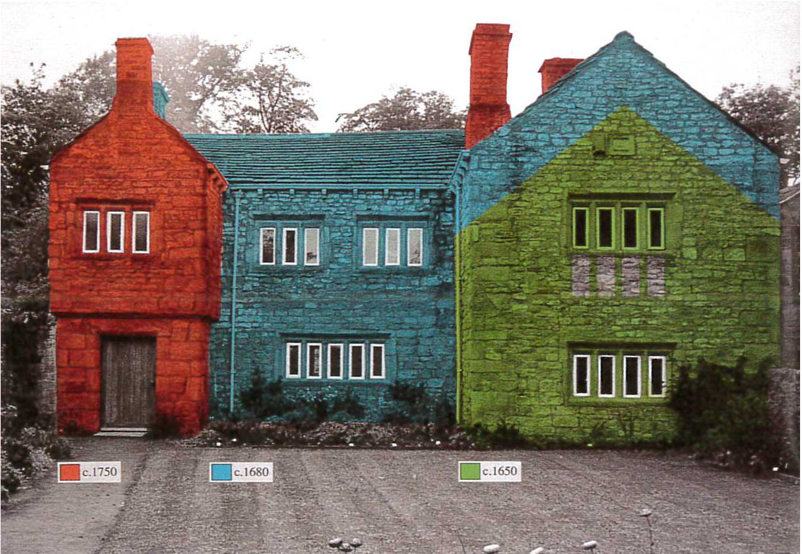

# The old roofline

Here's where the original roof-line was, in the 1630s.  

  

This part of the building was extensively modified in the 1700s. They literally raised the roof - by a few feet, at about the same time as they added some new sash windows. Very fashionable at the time.

How the building changed over time.

