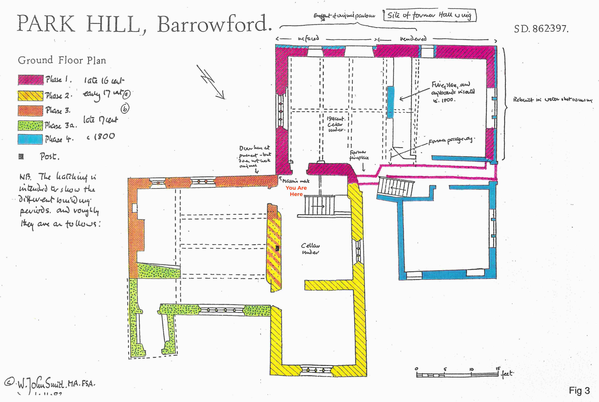

# Four Buildings
There are four buildings in one, here. Each was built in a different time. 
There is tantalising evidence, too, of an original timber building, which would have sat in the middle of the walled garden.  
The first phase building looks to have been built in the late 1500s. Its outer door is just behind you.  
This building was added in the early 1600s, in the second phase.  
Through the door in front of you lies the third phase, added in the late 1600's.   

Image Credit: W John Smith

