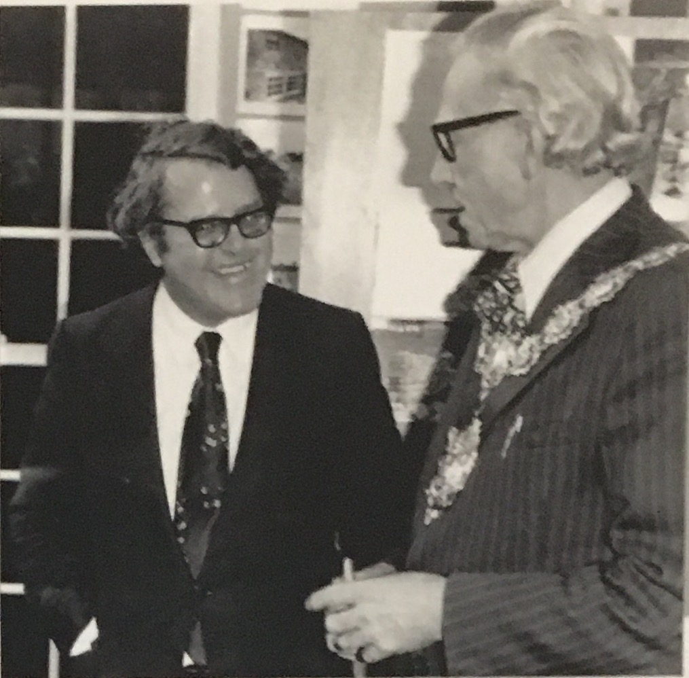

# Park Hill and The Heritage Trust for the North West

Back in 1977, this was the first restoration undertaken by the Heritage Trust for the North West.
The Trust seeks to rescue and restore buildings of historic significance, finding new uses for them to ensure their safety in the future. It records their histories, sharing them widely in the hope of inspiring people to find out more about the buildings that surround them.

At the opening of the Pendle Heritage Centre at Park Hill, Lord Briggs said something which is as true now, as it was then:

***"Heritage Education is a major national necessity if we are to make the best use of our environment. A heritage education centre is not a museum. A heritage education centre is a place of life anda place where I hope activities will go on, where children and adults will come into this building and learn somethng from it and indeed contribute to it by getting to know more abot their past, more about the possibilities of the present and some kind of vision for the future. A heritage education centre is not a place where we preserve a dead heritage; it is a place where we transmit a living heritage."***

