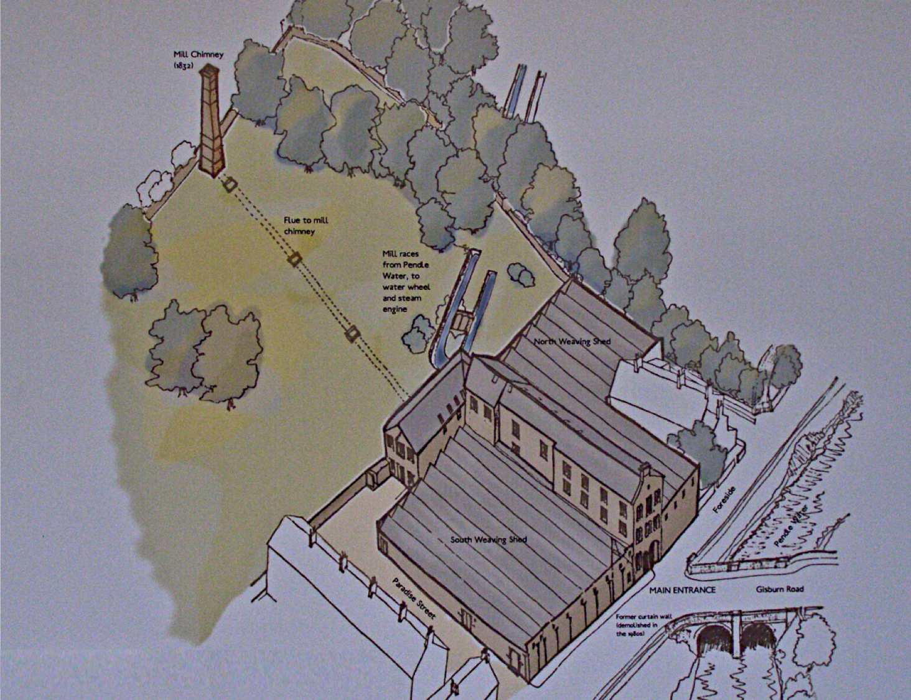

# Chimney

The chimney is carved with the year of its build; 1832. It's 80ft tall and square in cross-section, as all early chimneys were; later ones are round. It sits on top of the hill - which doubles its effective height - and is connected to the mill's boilers by an underground flue.

This was the first local mill to get an engine. At the time all the other mills in the area were water powered. The engine would have provided extra power for mill's looms, in addition to its waterwheel. 

Credit: Anthony Pilling
