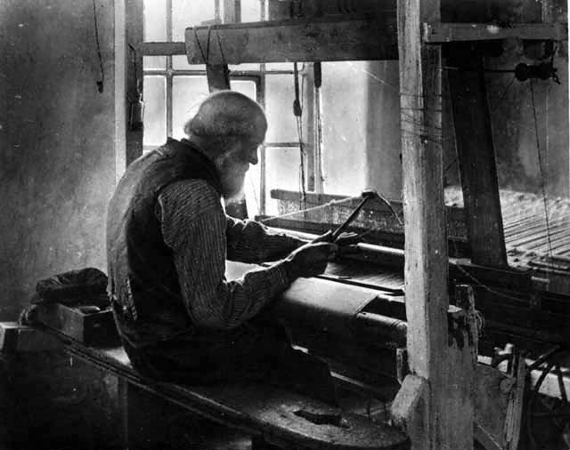

# Handloom weavers' houses

At the start of the 1800s handloom weavers worked in their houses in small communities in Lancashire.  

The Grimshaw family employed hundreds - putting-out work, supplying yarn and collecting the finished product - narrow strips of fabric, mostly Calico, 50 yards long (nearly 46m).

Grimshaw would send the fabric on to printers in towns like Clitheroe and Catterall, before selling to manufacturers.  

By 1820, there were over 170,000 handloom weavers in Lancashire, using this work to supplement whatever other income they had - mostly farming.

Working at home like this suited them, especially in winter; roads were mostly mud, so they couldn't travel far to work every day. But weaving cotton needs humid conditions, so most people worked in their cellars. It wasn't the best work-from-home deal.

{: .align-center }

Iñazio Irizar/ [CC-BY-SA-3.0](https://creativecommons.org/licenses/by-sa/3.0/)