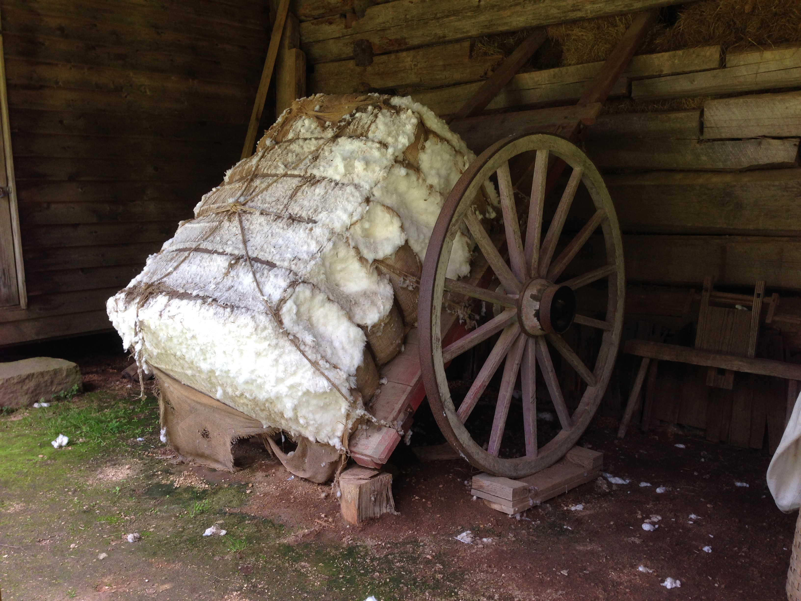
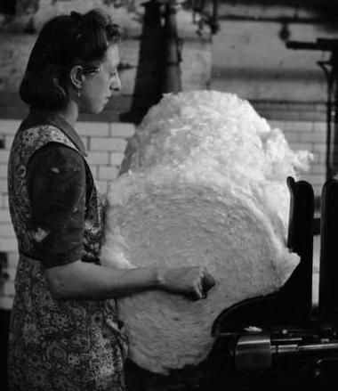
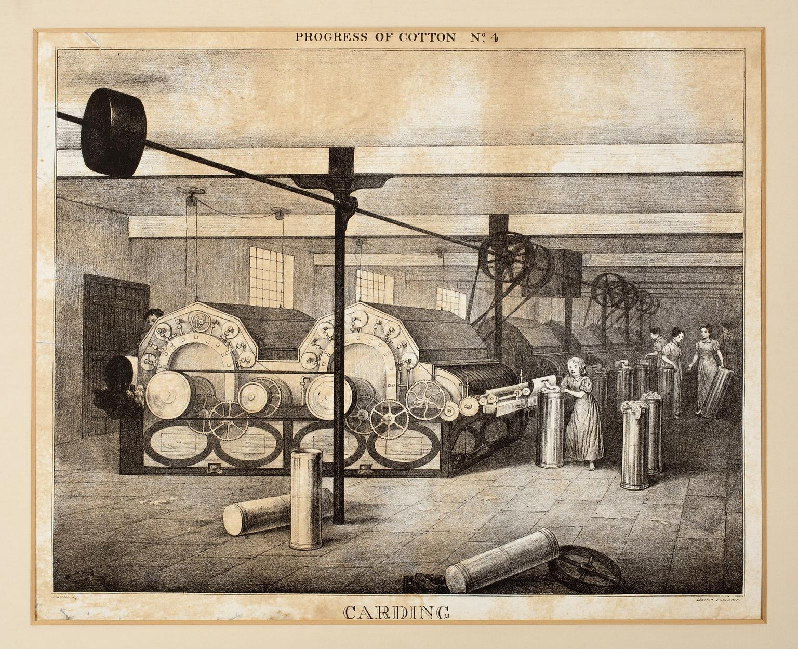
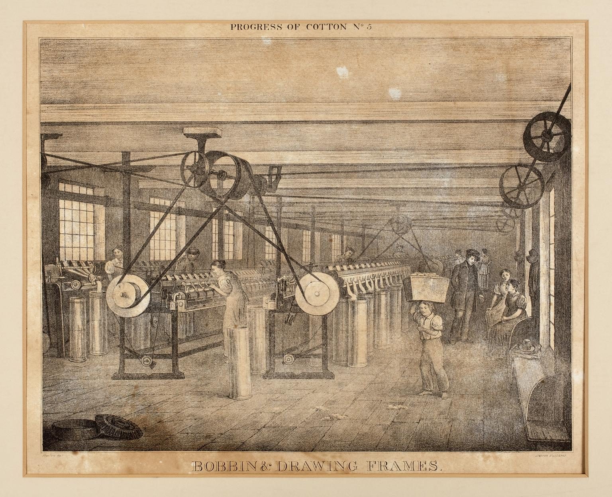
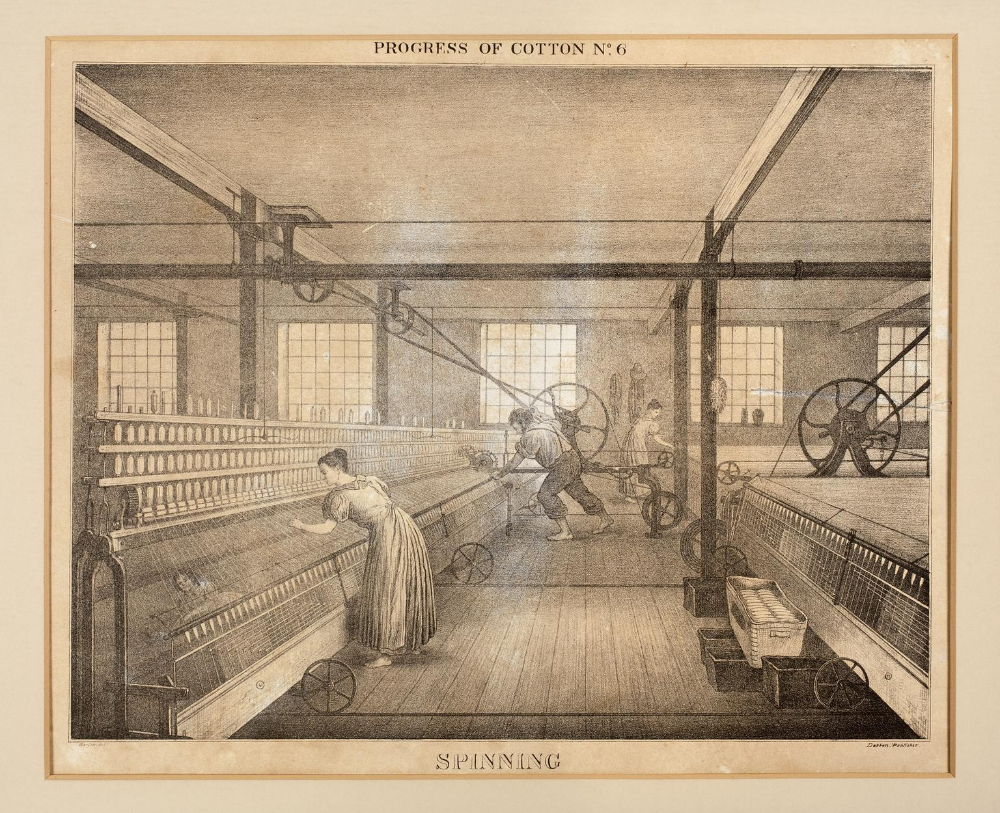
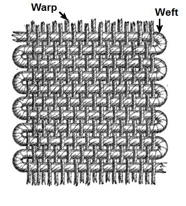
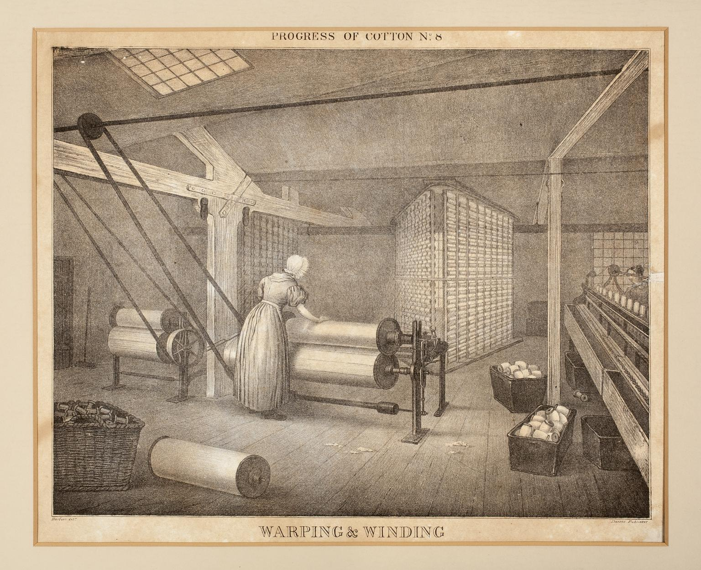
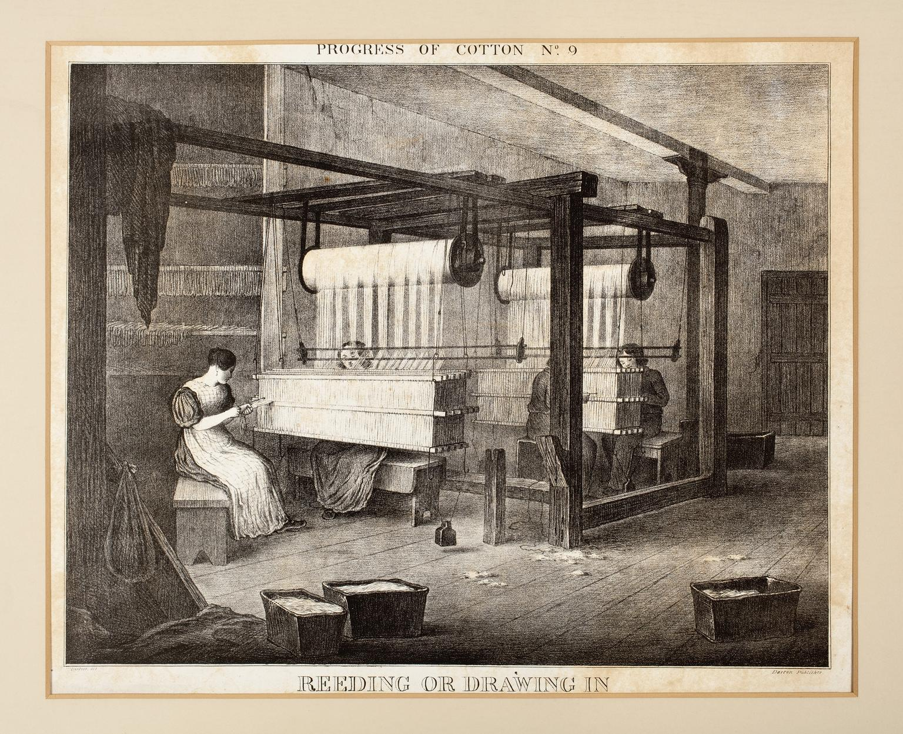

# Hoist
Here's the lift by which the product is taken to the seperate floors during its processing. Each floor does something different. 
Don't forget that Higherford Mill has changed many times in it's history: Spinning only, Spinning and weaving combined, and then exclusively weaving.

## Spinning - from 1824 to 1832
Grimsshaw's operate a 4 story spinning mill, powered by waterwheel.
The cotton 'product' is loaded onto a trolley and taken to a hoist to be transported to the next floor.

### Ground Floor
Bales of cotton are brought in and stored until needed.  

Image Credit: [Kevin Ryan](https://pixabay.com/users/kevincodeforclt-2794506/?utm_source=link-attribution&utm_medium=referral&utm_campaign=image&utm_content=2128197)

They are broken up, blended and 'scutched', removing seeds and leftover bits of the cotton plant.
This makes rolls of clean cotton wool, called a 'lap'. Very heavy.

  
Image credit: Imperial War Museum: [IWM D 25986](https://www.iwm.org.uk/corporate/policies/non-commercial-licence)

### First Floor

Here's where you'll find the 'carding' machines. They perform a combing operation on the cotton, aligning the fibres, so they make a strong thread when spun.
This makes soft weak ropes of cotton fibre, called 'slivers', which are coiled up into cans to protect them.
Carding machines were dangerous: unwary workers sometimes lost fingers or arms in their crushing grip.

  
Image Credit: Science Museum Group [CC BY-NC-SA 4.0](https://creativecommons.org/licenses/by-nc-sa/4.0/)

### Second Floor

Cans of sliver are delivered to drawing frames, which combine many slivers into one.  The new sliver has a very regular thickness, with the fibres lying parallel to each other. 
Roving frames reduce slivers to about 1/8 of their orignal diameter, pulling and twisiting it slightly, so it's strong enough to be wound onto a bobbin, ready for spinning. 

Image Credit: Science Museum Group [CC BY-NC-SA 4.0](https://creativecommons.org/licenses/by-nc-sa/4.0/)

### Third Floor
Bobbins are delivered to Throstle frames, which spin the roving into yarn. 
They're call Throstles, because they make a noise like a song thrush - if the song thrush was 8 feet tall and weighed the same as a family car.

Image Credit: Science Museum Group [CC BY-NC-SA 4.0](https://creativecommons.org/licenses/by-nc-sa/4.0/)

### Outbuilding
An outbuilding on the south side of the mill had two storeys. Grimshaws hired handloom weavers, working on Dandy looms. This was additional to the community of handloom weavers in the village. The mill would supply them with its own yarn.

## Spinning and weaving - 1832 - 1848
In 1832, the Grimshaws cleared out the handloom weavers from the outbuilding and installed 74 powerlooms instead. For this, they needed the power of a beam engine. The Grimshaws were certainly on top of their game, here; Higherford Mill is one of the earliest mills using powerlooms, and certainly the first in the area to use steam power.

## Spinning and Weaving - 1849 - 1856
The North weaving shed is completed to complement the spinning mill. It's pretty clear there's no love lost between the Grimshaws and the handloom weavers they displaced: the weaving shed is in an L-shape around their cottages. The handloom weavers wouldn't sell. Seems the Grimshaws always hoped they would; there are columns built into the shed's wall to extend and complete the square.

### Ground floor: Preparing the yarn for weaving, despatching the cloth
The hoist would have been used to take finished yarn down to be woven. At least a quarter of the North shed would be taken up with peparing the yarn before weaving, and then inspecting and packaging the woven fabric for despatch. 

Woven fabric is created by weaving a weft thread, in between vertical warp threads, using a loom:  
  
Image Credit: [Kafziel](https://commons.wikimedia.org/wiki/User:Kafziel) [cc-by-sa-3.0](https://creativecommons.org/licenses/by-sa/3.0/deed.en)

### Warping and Winding
The warp threads are loaded on to the loom on a huge roll, called a beam. This is fitted to the head of the loom. When the loom is weaving, the warp threads are gradually paid out, and the warp thread is woven in between them.
The beam has to be made so that all the warp threads are wound on in parallel:  

### Reeding (or drawing-in)
When the beam is fitted to the loom, the warp threads (often hundreds, or thousands) must be threaded through guides, or heddles. The loom moves the warp threads individually as it creates the cloth:  

## Spinning and Weaving - 1856 - 1882
This is now the golden age of the mill. The great achievement was to be able to spin and weave, at scale, on the same site. 
The warehouse building was built next door to the spinning mill, and over the top of the waterwheel.
It was able to take-over all the preparation, inspection and despatch depatments from the North weaving shed.

### Second Floor Warehouse
Oddly, connects with the 3rd floor of the spinning mill - so now all the yarn can be passed quickly accross from spinning.
This floor now deals with preparing the warp beams and bobbins holding the weft thread and storing them, ready for use.

### First Floor Warehouse
Here's where fabric is inspected, packed and stored, ready for despatch. The offices are also on this floor. They have their own set of stairs...

### Ground floor Warehouse
Goods-in, Goods-out. 

 

