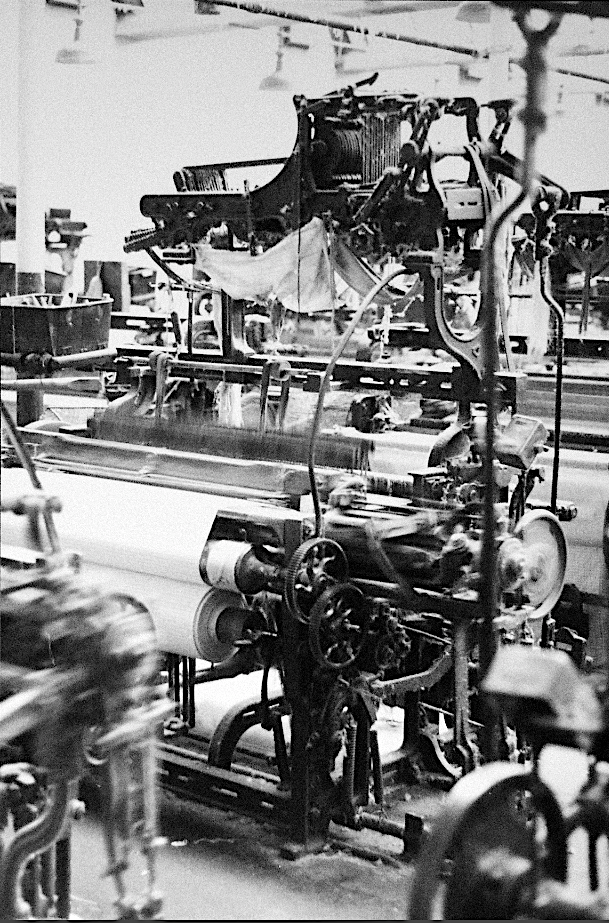

# 'Old' North Weaving Shed

This shed was built sometime around 1849 and marked Higherford Mill's push into weaving fabric at a grand scale.

The main warehouse building which you can see from across the river hadn't yet been built, so the shed housed around 160 looms, and did all its own storage, inspection and despatch.
When the main warehouse was built it could operate at its full capacity - over 214 looms.

Loom operators needed lots of light to see by. From the side, the roof has a 'saw-tooth' profile, familiar from factories everywhere. This is so that the roof can hold many windows. They are all angled to face North. This is to avoid strong sunlight, which is bad for the cotton. 

Weaving sheds usually have only one floor. Early-on, many mill owners made the mistake of putting powerlooms into the multi-storey buildings they used for spinning, which shook them to bits.

The mill has always used a combination of power sources. Two drive shafts came into the building - one from the mill's steam engine, and one from the waterwheel. A special device called a Dog Clutch was used to combine the two into a single drive to power all the looms. You can still see the brackets which held the drive shaft, fastened onto the cast iron columns holding up the roof.

The thin columns and the fragile driveshaft brackets date this shed. It's the earliest surviving north-light structure in the world. 

  
Weaving in the North shed, 1969.
Image Credit: Anthony Pilling