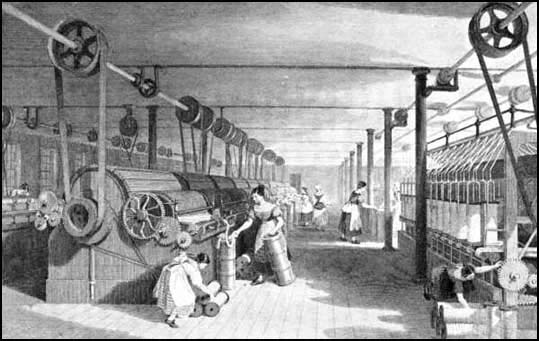

# Power

It all started in 1823, when Thomas Grimshaw makes the massive investment to build a spinning mill on his orchard. 
He mortgages his house, chops down the trees, and embarks on some other 'landscaping' activities - to exploit the only power resource available at the time - water.

He was responsible for digging the 'lodge' - a small reservoir of about an acre, and diverting the river - Pendle Water - to fill it.
Then he had constructed 2 'leats' - channels bringing the water down the hill - to the mill, one from the lodge, and one directly from the river.
At the mill, the leats were combined into a double-decker 'pentrough' - a cast iron channel running to a water wheel.

## Water (1824 - 1962)
The first waterwheel was made from wood. It was 26ft high and 9ft wide (That's nearly 8m high and 3m wide). 

It produced enough power to drive the 4 story mill and all the processes it took to turn cotton bales into yarn, and to load that onto special rolls to be delivered to the 400 or-so local handloom weavers.

The waterwheel slowly turned a main cast-iron driveshaft which went up the side of the building. 
Special gear-boxes on each floor turned a drive shaft for that floor.

Each machine had its own belt wrapped round a wheel on the driveshaft.

Belts and driveshafts were the way the mill worked, pretty much until it closed in 1971. They added some electric motors to the looms in the North Shed in 1936, but that was only because the belts were shaking the poor old roof down.

Water was used to power the mill for various things right the way through until the 1960's, when floods damaged the leats' wier.

## Water and Beam Engine (1832 - 1889) 
## New Power Looms (1832) - 74 Looms
By 1832, the mill was weaving on around 74 early power looms.
The beam engine was installed to help turn the waterwheel's driveshaft. As well as the added power, it also kept the shaft turning at a constant rate for the looms, which increased the quality of the fabric they created.

### More Looms, same power (1849) - 113 Looms
Looking at the records, they finished the North Weaving shed, and brought in loads more looms, bringing the total to about 113. The beam engine and water wheel combo seems to be able to cope.

### More Looms, more power (1868) - 200 Looms
We know that the North Shed is at full capacity at this point, on 200 looms. 
We also know that the original beam engine and waterwheel couldn't have driven this size of operation. It looks like they must have installed a higher pressure boiler at some point for more power.

### More looms, even more power (1882) - 458 Looms
It's at this point that the spinning mill is demolished, and the mill goes full-on weaving, with a new South Weaving Shed. There are now 458 looms.

Hard to belive, but water-wheel technology had plenty of innovations still to go. A new water-wheel was added, with 'ventilated buckets'. It added 24% more power. Just by changing the shape of the buckets, so the water didn't splosh out.

The beam engine was upgraded with another cylinder. It would have provided an impressive 220 horse-power. That's about the same as a mid range sports car. 

## Water and Tandem Engine (1832 - 1936) - 484 Looms
A huge investment - a new engine, with a new engine house was built, while the beam engine was still operating. 
The Daniel Adamson Tandem compound engine was brought online and the old engine dismantled. The extra space was given over to more production.
The new engine gave 200hp, about the same as the beam engine, but it was smaller, and much, much cheaper to run.

By 1906, the mill was running 484 looms

### The end of the water wheel (1921)
The water wheel was replaced with a more efficient turbine. Bad news. The sheer weight and size of the waterwheel was really good at ironing-out any changes in flow.  With the lighter turbine, it's much more difficult to keep the speed in sync with the steam engine.

### Enough of the turbine! (1926)
The turbine is disconnected from the drive to the looms, but finds better work driving a gnerator, instead. Lights are now hydro electric!

## Water and Diesel Electric (1936 - 1971)
During the Great Depression, from 1929 right through the 1930s global trade dropped by half. This hit the UK textile industry badly. The mill closed for 2 years. When it opened, the Adamson engine had been sold, just to keep the company alive. 

### The Sentinels (1936)
Two of these diesel units supply the power to drive electic motors. The South shed is driven in the traditional way, by the same driveshaft. For the North shed, they ran in power cables to motors on the looms themselves. 

### The Maclarens (1950's)
These new engines replaced the worn-out Sentinels, but one is kept on standby.

## Wove-out (1971)
When the Mill ceased production, its assets, the waterpower works and associated land were divided up and sold off. The new owner of the mill converted parts of it to commercial workspace units. A yard was formed along Gisburn Road by dismantling the front wall of the 1882 South weaving shed and reusing the masonry to build an accessible frontage set back from the main road. The Old Shed was also subdivided and units let as workshops or for storage. Due to lack of maintenance the rest became derelict. Uses included engineering, automotive electronics fitting and valeting, garden furniture and fireplace manufacture, pump servicing, cushion making and cloth warehousing.

----

Thanks to Anthony Pilling