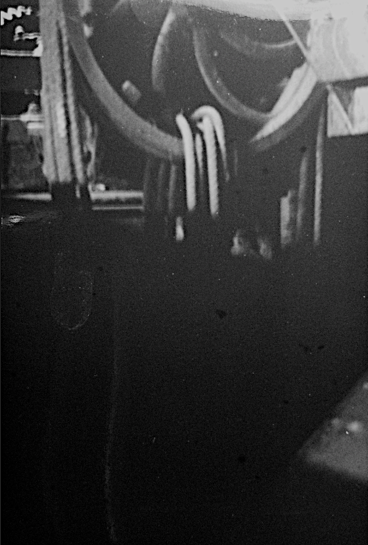
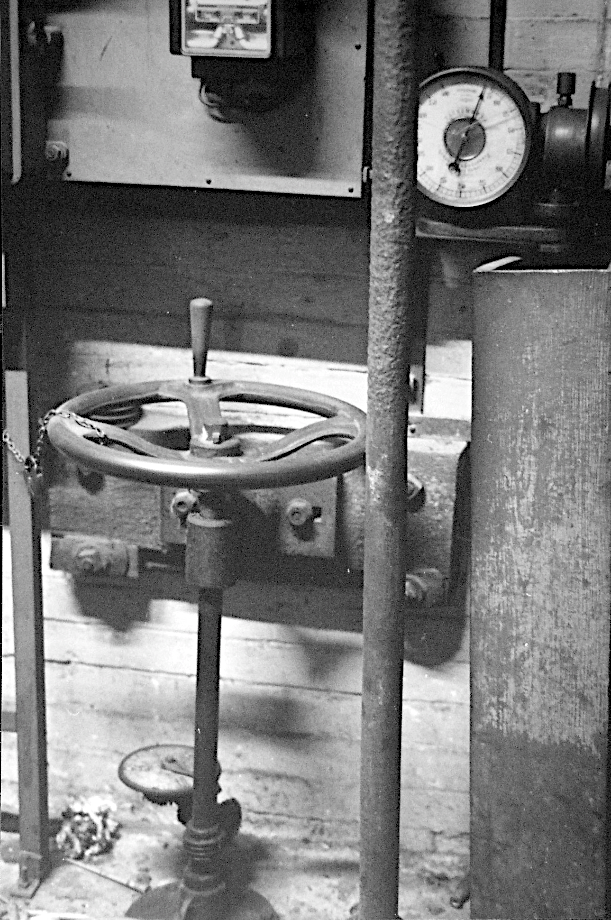

  
## Turbine Chute

This metal chute was installed in 1921, when the pentrough above it was blocked off, and the waterwheel removed.  In channeled water in to drive a new and more efficent turbine.
  
Turbine rope pulley, 1969 - turbine water chute to the bottom right.
Image Credit: Anthony Pilling

Turned out it was no good for powering the looms and after 4 frustrating years, they hooked it up to the lights. Presto! Hydro-electric power.
  
Turbine controls, 1969.
Image Credit: Anthony Pilling
