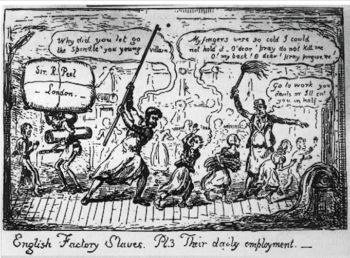

# Workers' staircase
This staircase has been here since this warehouse building was built in 1856, just next to the spinning mill.
Until 1882, this was the way the spinners went in the morning and left in the evening. After that, no more spinners - the whole mill was demolished and replaced with a weaving shed.

The stairs' treads are worn from years of steps - when the first set of treads wore out, another set were simply nailed on top. 

## The Cotton Mills
The mills were early factories, moving cotton through a set of processes and machines, which seperated straightened, and twisted cotton fibers, combined them into yarn, then wove the yarn into cloth. 
The industry was very competitive and fortunes could be made. But labour laws were non-existent and weathly owners treated their workers with deep prejudice, routinely exploiting them.
The mills were built, furnished and staffed to produce as much product as possible, as cheaply as possible:  
As many machines as could fit, inside a building kept hot and humid for the best conditions for working cotton.  
As many staff as could work the machines at the least possible cost, working the longest hours possible.  
As little money spent on the welfare of workers as possible. Best to employ children.  

### What was it like?
It was unbearably hot and deafeningly noisy.  
It stank - of oil, dust, body odour and poor sanitation.  
The air was thick with cotton fibres.  
There was a huge fire-risk.  
There was a constant risk of injury.  
Violence and beatings were normal.  
Disease and early death were normal.  
Life expectancy? 40, if you got past 5.  

## Are you sure?
From 1802 to 1891 there were over 18 Acts of Parliament passed as the country recognised that something was seriously wrong and tried to change. 

But even as late as 1948, textile workers were still suffering from respiritory diseases, although the causes were understood 100 years before; pulmonary tuberculosis - from inhalation of fibres.  

From an 1863 article in the medical journal the Lancet - ‘A carder seldom lives in a cardroom beyond forty years of age. Many have to give up working much younger’.

Perhaps the most desperate story to tell comes after the Factory and Workshop Act of 1878 - which only *reccommends* ventilation of factory spaces - some workers complained of hunger as a result of the improved ventilation. It was because there was less cotton in their stomachs.

### What about here?
The Grimshaws owned the mill until 1869. They were well regarded in Barrowford. Of Christopher Grimshaw, the most prominent member of the family at that time, it's written:  "During the cotton famine, about the years 1862-3, he took a great part in the relief of the distress caused by the stoppage of the mills, thus showing his great interest in the welfare of the village". So we can hope that Higherford Mill saw to its staff a little better.  

  
A cartoon by Robert Cruikshank, c. 1835

