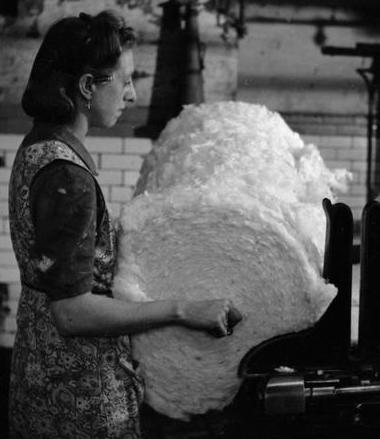
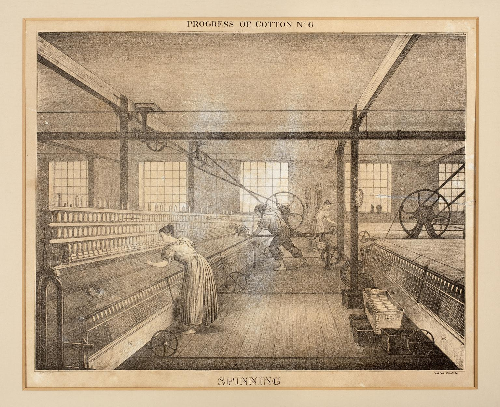

# Workers' staircase
This staircase has been here since this warehouse building was built in 1856, just next to the spinning mill.
Until 1882, this was the way the spinners went in the morning and left in the evening. After that, no more spinners - the whole mill was demolished and replaced with a weaving shed.

The stairs' treads are worn from years of steps - when the first set of treads wore out, another set were simply nailed on top. 

# How did they work?
The mills were early factories, moving cotton through a set of processes and machines, which seperated straightened, and twisted cotton fibers, combined them into yarn, then wove the yarn into cloth. 
Early industry was very competitive, fortunes could be made. But labour laws were non-existent and weathly owners treated their workers with deep prejudice, routinely exploiting them.
Workers were barely able to earn enough to feed and clothe themselves. Children worked alongside their families. 
The mills were built, furnished and staffed to produce as much product as possible, as cheaply as possible.
As many machines as could fit, inside a building kept hot and humid for the best conditions for working cotton.
As many staff as could work the machines at the least possible cost, working the longest hours possible.
 
***What was it like?***
It was unbearably hot and deafeningly noisy.
The air was thick with cotton fibres, causing lung dieseases.
There was a huge fire-risk.
There was a constant risk of injury.
Violence and beatings were normal. 
There was no escape.

## Spinning - from 1824 to 1832
Grimsshaw's opeate a 4 story spinning mill, powered by waterwheel at first - they added a beam engine later.

### Ground FLoor

Bales of cotton are brought in and stored until needed.

Image Credit: [Kevin Ryan](https://pixabay.com/users/kevincodeforclt-2794506/?utm_source=link-attribution&utm_medium=referral&utm_campaign=image&utm_content=2128197)

They are broken up, blended and 'scutched', removing seeds and leftover bits of the cotton plant.

This makes rolls of clean cotton wool, called a 'lap'.

  
Image credit: Imperial War Museum: [IWM D 25986](https://www.iwm.org.uk/corporate/policies/non-commercial-licence)

***What was it like?***
The laps are ev

***What next?***
The laps are extremely heavy; they are taken on trolleys to a hoist, up to...

### First Floor

Here's where you'll find the 'carding' machines. They perform a combing operation on the cotton, aligning the fibres, so they make a strong thread when spun.
This makes soft weak ropes of cotton fibre, called 'slivers', which are coiled up into cans to protect them.

  
Image Credit: Science Museum Group [CC BY-NC-SA 4.0](https://creativecommons.org/licenses/by-nc-sa/4.0/)

***What's it like?***
Carding machines were dangerous: unwary workers sometimes lost fingers or arms in their crushing grip. 

### Second Floor

Cans of sliver are delivered to drawing frames, which combine several slivers into one.  The new sliver has a very regular thickness, with the fibres lying parallel to each other. 

Then there's *roving*, which reduces slivers to about 1/8 of their orignal diameter, pulling and twisiting it slightly, so it's strong enough to be wound onto a bobbin, ready for spinning. 

Image Credit: Science Museum Group [CC BY-NC-SA 4.0](https://creativecommons.org/licenses/by-nc-sa/4.0/)

In to the hoist, to the...

### Third Floor

Throstle frames spin the roving into yarn. They're call Throstles, because they make a noise like a song thrush.

Image Credit: Science Museum Group [CC BY-NC-SA 4.0](https://creativecommons.org/licenses/by-nc-sa/4.0/)

In the back there were also two storeys available for handlooms, so the Grimshaws were employing weavers on-site, as well as simply spinning. 

